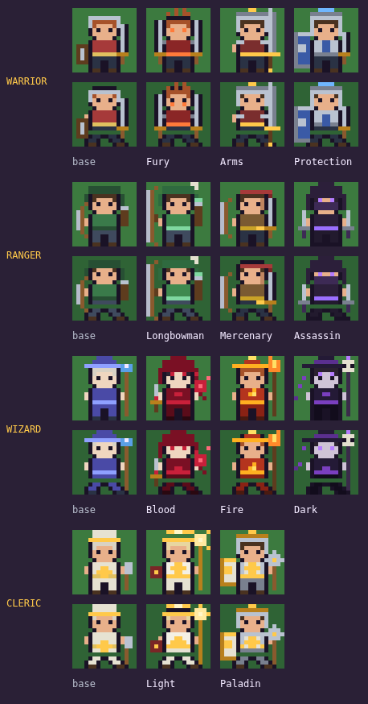

# Realm of Majesty

A 16-bit kingdom sim, written as a single dependency-free web page and built to be
played with a thumb on a phone.

**The premise:** you are a small god with a valley full of peasants. You do not
micromanage them. You tell each one **what they are for**, and they go and find the
work themselves.


## Playing

- **One finger drags** the map, **two fingers pinch** to zoom, **tap** to select.
- **Zoom** steps through Close / Mid / Far / Wide. Tap the corner map to open the whole
  realm, then tap anywhere on it to jump there.
- Select any unit and hit **Follow** to lock the camera onto it; drag the map to let go.
- **Tap your City Centre** → *Hire Peasant*.
- **Tap a peasant** and pick a calling: **Mine**, **Wood**, **Stone**, **Build** or **Idle**.
- Or open the **Folk** tab to move the workforce around in bulk, or pick one villager
  by name and give them a calling of their own.
- **Build** a Lumberyard or a Mining Camp out beside a far seam — it becomes the depot
  everything is hauled to, and it makes the crew around it faster.
- Cover an outpost with a **Guard House** or a **Watch Tower**, because raiders go for
  whatever building is nearest and that is now yours.
- **Build** a Barracks and **hire** a warrior, then raise a **Flag** to tempt them somewhere.
- The build menu **opens up as you play**. Day one offers three things —
  lumberyard, mining camp, barracks — and each one you finish unlocks the next
  rung. Everything except the blacksmith used to be available immediately,
  because almost every building was gated on the City Centre and you start
  with one, so the opening was eleven cards and no guidance.

| Finish this | and this unlocks |
|---|---|
| *(nothing — day one)* | Lumberyard, Mining Camp, Barracks |
| Lumberyard | Marketplace |
| Barracks | Guard House, Rangers Guild |
| Mining Camp | Watch Tower |
| Marketplace | Inn, Blacksmith, Wizards Guild |
| Inn | Temple |

The **Warriors Guild is gone.** It was a second Barracks with a different name
and forty more gold on the price, it was never in the build menu to begin
with, and drilling a Barracks now covers everything it was for.

The **Peasant Hut is shelved, temporarily.** It is out of the build menu but
everything about it is intact in `src/data.js` — put `'hut'` back at the front
of `BUILD_ORDER` and it returns exactly as it was. Note what goes with it
while it is away: the hut is the only building besides the City Centre that
raises the **population cap**, so the realm sits at the palace's fourteen for
the whole game. Heroes cost no population, so that is fourteen peasants and
as many soldiers as your guilds will hold.

Keyboard, if you are at a desk: `B` peasants, `K` realm, `P` select peasants,
`M` full map, `C` follow the selected unit, `space` pause, arrows pan, `+`/`-` zoom,
shift-drag to box-select.

**Every soldier wears their bars.** Anyone who fights for the realm keeps a
health bar and a **rank bar** over them at all times — not only when hurt — so
you can see who is close to a promotion without opening a sheet. Casters keep
their mana bar and anyone with an ability keeps its charge bar on the same
stack. Workers stay clean: a field of peasants with furniture over every one
of them is unreadable. Heroes who reach the **rank cap** get a **name** over
them in the colour of their specialisation, because level five is the one
permanent thing that happens to a hero and from then on they are somebody you
know by name rather than another figure in the crowd.

**Gold, wood and stone are icons, not letters.** A build cost, a price, a
bounty, a bag of ore on a peasant's back and a seam's remaining yield all read
as a coin, a log or a block with a number beside it, rather than `130g 70w
20s`. The word is still there -- it is the tooltip, and the label a screen
reader announces -- so nothing is lost by not spelling it out on a phone.

## Callings

A calling is permanent until you change it, and it is a *standing instruction*, not a
destination. A Miner walks to the nearest gold seam, works it until it is empty, and
then walks to the next nearest one without being asked. When there is genuinely nothing
left they say so by name and wait near home rather than milling about pretending.

| Calling | What they do |
|---|---|
| **Miner** | Finds the nearest gold mine and works it out, then the next. |
| **Woodcutter** | Fells the nearest woodland tree by tree; felled trees disappear. |
| **Quarrier** | Cuts stone at the nearest quarry and moves on when it is spent. |
| **Builder** | Runs to whatever is half-built or damaged. |
| **Idle** | Loiters near home and lends a hand with construction. |

You can still override a calling by tapping a **specific** mine, quarry or tree — that
sets the matching calling *and* starts them on the seam you picked. The **Peasants** tab
also lists every peasant by name, so you can single one out and give them a calling of
their own.

## Attributes

Every unit has four attributes. Five is the baseline — a unit with straight fives
behaves exactly as its raw definition says — and **every single point counts**, so
nothing a level ever grants is rounded away.

| Attribute | Effect |
|---|---|
| **Strength** | +4% melee damage per point |
| **Agility** | +1.6% attack speed per point |
| **Constitution** | +7 health per point |
| **Intelligence** | +4 mana per point, +0.22 mana a second, and +0.8% critical chance per point (capped at 45%) |

**Strength used to buy 2.2% a point and it was not enough.** A rank-capped
warrior did 26 damage a swing; a day-30 raider did 51 and had more health than
the warrior did. Veterans were not meaningfully better than recruits and no
party could out-damage a monster with a defensive trick -- trolls regenerated
faster than four heroes could cut, wraiths soaked more than they could
replace, and cultists simply could not be reached. At 4% a point a capped
warrior hits for 36 and a fresh one for 16, so rank is worth something and a
gimmick is an obstacle rather than a wall.

Monsters get the same deal with one exception. The day's **threat** used to
buy a raider all four attributes at full rate, which at 4% a point would have
made a late raid unsurvivable. Time now makes a monster **harder to put down
rather than quicker to kill you**: constitution, agility and intelligence
climb at the full rate and strength at half it (`THREAT_STR_SHARE`).

Peasants sit at 5 across the board and stay there — they are workers, not projects.
Hero classes arrive lopsided, and that is the whole class system: a warrior is strong
and tough and never crits, a wizard is frail and crits often.

A hero's numbers come from exactly four places, and every one of them is visible on
their sheet:

| Source | What it gives |
|---|---|
| **Class baseline** | what the profession is, e.g. a warrior at STR 8 / CON 8 |
| **Class bonus** | the layer on top, +8 STR / +7 CON for a warrior |
| **Rank** | **+5 to every attribute** per level, to a cap of level 5 |
| **Gear and specialisation** | what they looted and what they chose at the cap |

A freshly hired warrior is STR 16 / CON 15 with 200 health. **Rank is the only
progression a unit has, and rank comes from fighting** — the table runs
50 / 145 / 320 / 620 experience -- a quarter shorter than it was, because too
many realms were won without anyone reaching the cap -- so level 5 is a
campaign's work rather than an afternoon's. What that buys, measured against the same hero on their first day:

| Hero at level 5 | Health | Damage |
|---|---|---|
| Warrior (Fury) | ×1.70 | ×1.53 |
| Warrior (Protection) | ×2.23 | ×1.44 |
| Ranger (Longbowman) | ×2.25 | ×1.83 |
| Wizard | ×2.75 | ×1.44 |
| Cleric | ×2.01 | ×1.43 |

There used to be a second track: villagers trained attributes by working, and a knight
was a villager who had been walked through every calling first. It is gone. It read as
a checklist with one correct order rather than a decision — the fastest route to a good
knight was always the same five instructions in the same order — and it made the answer
to every question "grind another villager".

Progression now lives on the map instead. Every load walks to the nearest **depot**, so
**distance is the whole economy** — and the answer to distance is to move the depot.

## Outposts

At the start the City Centre is the only depot on the map, so every load walks the whole
way home and the rich far seams are barely worth working. Two buildings change that:

| Outpost | What it does |
|---|---|
| **Lumberyard** | A depot for timber. Woodcutters within 11 tiles fell **60% faster**. |
| **Mining Camp** | A depot for ore and stone. Miners and quarriers within 11 tiles work **50% faster**. |

Plant one beside a distant seam and it becomes the nearest depot for everything around
it: the walk collapses, and the crew gets faster into the bargain.

**An outpost is a bet, not a free upgrade.** Raiders march on whatever building is
nearest to them, and the far ground is where the lairs are — so a Lumberyard out at the
edge of the map is the first thing a camp finds. Two buildings answer that:

| Cover | What it does |
|---|---|
| **Guard House** | Keeps three guards who patrol within 150px and **never wander off**. |
| **Watch Tower** | Shoots bolts at anything hostile in range, and lifts the fog around it. |

Both cost the stone you went out there to cut, which is the loop: the far seam pays for
the outpost, the outpost pays for its cover, the cover lets you sit close enough to a
lair to be worth raiding, and clearing that lair opens the ground past it.

**The depot and the cover only work together.** Ten peasants put on the furthest gold seam of the
seed-4242 map — 506px from home, no soldiers anywhere, and with building tax switched
off so this measures the hauling alone — over four minutes:

| | Gold in four minutes |
|---|---|
| Bare seam | 0 |
| Guard House + Watch Tower, no depot | 14 |
| Mining Camp, no cover | 0 |
| **Mining Camp + cover** | **48** |

A bare far seam now returns *nothing at all*: at the lower carry rate the crew is wiped
before a single round trip completes. There is no multiplier to quote because the
baseline is zero — which is the point. Far ground is not a place you can simply send
peasants to.

Neither building gets close on its own: a depot with nobody guarding it is a depot your
crew never lives long enough to reach, and cover with no depot just means they survive a
walk that was never worth making.

That run is deliberately the worst case — the furthest seam, unescorted, with the peace
already over — and the crew is still wiped inside four minutes. Outposts buy you the
economy of the far ground; they do not buy you the right to be there. That part is what
soldiers are for.

Losing an outpost is a setback, not a defeat. Losing the City Centre still is.

## The treasury

Gold used to come almost entirely out of the ground, and then sit there. Measured over
thirty days: **74% of income was mining**, and **81% of every coin earned was never
spent** — the only thing actually limiting the realm was the population cap, so there
was no reason to build anything you did not immediately need.

Three changes, and they work together:

**Mining pays much less.** A gold seam yields `0.6`/second into a `12`-unit pack, down
from `1.5` into `20`. A miner is still worth having; they are no longer the whole
economy.

**Buildings pay much more**, and the outposts now pay too:

| Building | Tax |
|---|---|
| City Centre | 4 |
| Peasant Hut *(shelved)* | 3 |
| Lumberyard / Mining Camp | 4 each |
| Guard House | 2 |
| Marketplace | 10 |
| Inn / Blacksmith | 7 each |

Taxes come in every 12 seconds, so a Marketplace pays for itself in about three minutes
and then keeps paying. Pushing an outpost out to a far seam is now an *income* decision
as well as a logistics one.

**An army draws no wage.** It used to, and it made a level-5 veteran a bill you
paid forever; that is gone. The treasury is spent on two things instead, both
bought once on the building's own panel, both a decision rather than a cost of
standing still:

| Sink | Price | What you get |
|---|---|---|
| **Drill a guild: Drilled** | 220 | recruits arrive at **level 2**; the guild holds one more hero |
| **Drill a guild: Veteran** | 520 | recruits arrive at **level 3**; the guild holds two more |
| **Fortify a building** | a quarter of its health + 40 (a tower 150, a guard house 190, the City Centre 640) | **half again** the health, repaired to full; a tower hits 40% harder; a guard house keeps a fourth guard |
| **Upgrade a depot: Yard** | 200 | a lumberyard or mining camp works **×1.55** as fast over **3 more tiles**, and pays 3 more tax |
| **Upgrade a depot: Works** | 460 | **×2.2** as fast over **6 more tiles**, and pays 8 more tax |

A depot used to be a thing you put down once and never thought about again: as
good on day forty as on day nine, so the only way to gather faster was to put
down another one. Upgrading one is the same decision drilling a guild is —
gold, spent once, on something you already own, to make the ground you already
hold worth more than the ground you would have to go and take. A **Works**
lumberyard reaches seventeen tiles and more than doubles what its woodcutters
bring in.

Drilling is what closes the gap the far camps open: a Veteran barracks turns
out level-3 warriors, two ranks up the ladder before their first fight.

The readout beside your gold shows what the buildings bring in each payday.

### The Inn

The hearth mends **anyone of the realm within seven tiles of a finished inn**,
coin or no coin, at 9% of their health a second -- three times what they
recover standing in a field, and it stacks with it. A hero with gold takes a
bed instead: 25 gold for 45% of their health outright, and you tax that the
way you tax every other deal.

The building used to be a place heroes only ever reached by *fleeing past
it*. Nothing pulled them in: the errand that sent a hero to a shop was gated
on having 50 gold to spend, so the one soldier who most needed to sit down --
the one who had just emptied their purse at the blacksmith -- was the one who
never went. Now a wound is an errand in its own right. Below **75% health** a
hero starts weighing the walk to the inn against everything else they could
be doing, and the more serious the wound the more it outweighs; a soldier
**holding the line** weighs it higher still and walks further for it, because
between waves there is nowhere better for them to be.

It does not drag them off a fight. The pull is small while they are barely
scratched, and a monster near your buildings still outscores it several times
over -- they go when the shouting stops, which is exactly when you want them
topping up.

**And the inn is where a garrison waits.** A soldier on the **Defend** stance
with nothing in sight now posts at the nearest inn rather than walking a beat
around the buildings and the workers. Standing there means standing in the
hearth, so the garrison meets the next wave topped up instead of on whatever
health the last one left it with -- measured, six defenders converge inside
ten seconds, hold about two tiles out, and go from 60% health to full.

Nothing about leaving changes. A monster, a worker screaming, a flag: all of
them outscore standing at the inn by a wide margin. Four goblins landing
twenty-two tiles away pulled half the garrison out within six seconds, and
they were all back at the fire within a minute of the last one dying. With no
inn built, they walk the old beat exactly as before.

The economy was last measured with wages still in; the table below is that
measurement and will read high on gold left unspent until it is redone:

| | Mining | Tax | Market | Lairs | Gold left unspent |
|---|---|---|---|---|---|
| Before | 73.8% | 15.2% | 3.6% | 7.4% | 81% |
| After | 42.7% | 46.5% | 4.0% | 6.7% | 42% |

And it moves as the realm grows — mining is 60% of income on day 5 and 43% by day 20,
because early on you have almost nothing built. Mining bootstraps you; buildings sustain
you.

## Hiring soldiers, and flags

Build a **Barracks** (Warriors) or a **Rangers Guild** (fast archers who see further)
and hire from it. **A hero costs gold and nothing else** — no villager puts down a pick,
nobody drills, and your workforce does not shrink. Each guild holds only two or three,
so the number of soldiers you can field is a question of what you have built, not of
how many villagers you have ground through the fields.

| | STR | AGI | CON | INT | Health |
|---|---|---|---|---|---|
| Warrior | 16 | 7 | 15 | 5 | 200 |
| Ranger | 7 | 17 | 9 | 6 | 112 |
| Wizard | 5 | 6 | 7 | 19 | 80 |
| Cleric | 6 | 6 | 11 | 16 | 138 |

Soldiers do not take **callings**. They used to, and it read as flexibility and played
as a second, worse peasant: the guilds cap how many soldiers exist, so every one of them
standing at a seam was a soldier you had paid for and were not using. Callings are
villagers' work; soldiers are for fighting.

### Wizards and Clerics

Two more guilds, and two classes that are nothing like the first two.

A **Wizards Guild** hires a **Wizard**: fire at a hundred
pixels' reach that lands on *everything* standing together, not just what it
was aimed at. Full damage on the target and 60% on everyone within a
fireball's width of it, so the tighter a pack marches the worse it goes for
them. A wizard is also made of paper -- 66 base health and the earliest nerve
of anyone in the realm -- so they open at range and leave before it gets
close.

A **Temple** hires a **Cleric**, and a cleric does not wait to be
useful. They go *looking*: anybody in the realm below 72% health is a reason
to cross up to 520 pixels of map, and they hurry when they do. Two things
come out of them:

- **Mending** — 24 health every two seconds, more with rank, always on
  whoever is **worst off** within reach.
- **Blessing** — +25% damage and a fifth of the harm turned aside, for 20
  seconds, on **anyone who comes near**: a villager hauling ore as readily as
  a warrior mid-swing. Whoever is closest to a fight simply goes first in the
  queue. A cleric is not only a bandage.

**They travel with the soldiers.** A cleric is not a scout and not a duellist
— alone they are a robe with a mace — so with nobody hurt they keep station
near the nearest fighting hero rather than wandering. They never pick a fight
of their own, never take an attack goal, and back away from anything that gets
within three tiles, mending and blessing as they retreat. They swing only when
genuinely cornered.

Mana comes back faster the cleverer they are: a flat rate everyone gets, plus
a share per point of intelligence over five. **Both parts were roughly doubled**
— 2.0 a second flat and 0.22 per point of INT, from 1.2 and 0.12 — because a
cleric in a hard fight spent the whole fight waiting on the pool rather than
deciding what to spend it on. A cleric at INT 23 now regenerates 5.9/second
working (was 3.4); at INT 43, 10.4/second (was 5.8), out of a pool nearly
twice the size. Putting a *quarrier* through the Temple is worth doing.

Both cost **mana**, which is what intelligence has been quietly buying all
along: 4 per point of INT, refilling slowly while they work and faster while
they stand still. A cleric in a hard fight runs the pool most of the way down,
so how much they can do really is how clever they are.

Crucially a cleric keeps out of reach -- they back off from anything that gets
within about three tiles, mending and blessing as they retreat, and stand off
on the near side of a patient rather than walking into the melee to reach
them. The first version did walk in, and died in every single test.

Measured against a mixed pack of ogres and skeletons that three level-3
warriors cannot quite handle: without a cleric the party was wiped having
killed three of seven. With one, the same party cleared all seven and two
walked away. Roughly fifty heals a fight and three soldiers blessed at once.

Both specialise at the cap like everyone else -- see below.

### Loot

Monsters carry things, and the stronger the monster the likelier it is
carrying something worth having -- a rat almost never, an ogre two times in
five, a razed camp always. Whatever falls goes to one of the heroes who was
actually there, chosen at random among them.

Seven slots: **weapon, chest, neck, two earrings, two rings.** Weapons are
class-locked, so loot that lands in the wrong hands is carried to market
rather than silently wasted:

| Class | Carries |
|---|---|
| Warrior | swords, axes |
| Ranger | swords and daggers — **assassins** take swords, **mercenaries** daggers |
| Wizard, Cleric | staves, wands |

Four tiers, and what they carry:

| Tier | What it rolls |
|---|---|
| **Common** | one attribute |
| **Rare** | one attribute, larger — or two |
| **Epic** | two attributes and a modifier, with flavour text |
| **Legendary** | two attributes well above epic, a modifier, and a name of its own |

Beyond attributes an item can carry flat **damage** (axes hit flatly harder),
**mana**, **critical chance** (daggers find the gap), **lifesteal**, or —
legendary only — **spell power**, which multiplies a wizard's fire and a
cleric's mending alike.

Names are built from what the thing is and what it does, so they read:
*Band of the Bear*, *Thorn Brigandine of Deep Waters*, *Grim Waraxe of the
Bear*. Legendaries get names instead of descriptions — *Serathil*,
*Ironhowl*, *The Unbroken Circle*, *Coat of the Drowned King* — and epics and
legendaries carry a line of flavour.

**Heroes judge loot on their own terms** and nobody else's:

| Class | Wants |
|---|---|
| Warrior | STR > CON > AGI |
| Ranger | AGI > STR > CON — and a longbowman, who never closes, discounts strength |
| Wizard, Cleric | INT > CON > the rest |

They wear it if it beats what is in that slot by their own reckoning, and
carry it to market if it does not.

**Loot has a face.** Every item draws as a 16x16 icon -- one silhouette per
kind of thing, so a sword reads as a sword whatever it is worth -- inside a
frame in the colour of its tier: **grey common, blue rare, purple epic,
orange legendary**, with a glow on the last two. The tier is deliberately not
in the silhouette: a legendary sword is the same sword, only better kept,
brighter metal and a live stone in it. Hovering an icon gives the whole item
in words -- name, tier, what it does, its flavour -- so shrinking it to an
icon costs nothing. `?sprites=1` shows every kind against every tier.

### The Marketplace

Five shelves, restocked over time, and the stock improves as the realm does.
Heroes walk in on their own: they sell everything in their bag, then buy the
one thing on the shelf that beats what they are wearing and that they can
actually afford. **You tax both ends of every deal** — a quarter of what they
sell and near a third of what they spend — so a marketplace is an income, not
an expense. What they sell goes straight back onto the shelf for somebody else
to find.

### Experience, and who gets it

Rank used to go entirely to whoever landed the killing blow. Three warriors
beating a skeleton together meant one of them got all 24 experience and the
other two got nothing, and a cleric who kept all three alive got nothing ever.

Now **everyone who had a hand in it shares**, and taking part means either
hitting the thing or being hit by it -- so a Protection warrior holding a
camp's attention while the others do the killing earns their share of it.
Credit lasts 12 seconds, so wandering in at the end earns nothing.

The pot is a little larger than a lone hero would have earned, capped at four
contributors, and split evenly:

| Party | Each gets | Pot |
|---|---|---|
| Alone | 100% | 1.00x |
| Two | 58% | 1.15x |
| Three | 43% | 1.30x |
| Four or more | 1.45 / n | 1.45x |

So an individual share is always smaller than a solo kill, but the party as a
whole earns more, and nobody is ever left out. Gold from a kill still goes to
whoever struck the blow -- heroes are greedy, and that has never been fair.

**Healers count at half weight.** A cleric supports every kill in a fight
rather than some of them, so on a full share they would out-level the soldiers
they exist to keep alive. At half they level alongside. On top of that they
earn rank directly for the job: experience per point of health *actually*
restored, so topping up somebody already full pays nothing and there is
nothing to farm, plus a little for each blessing.

### What happened to talents

Every calling used to hand out three **talent points**, spent per villager in that
calling's own tree — carry more, work faster, walk quicker. Three trees times three
talents times three ranks, chosen individually for every peasant you owned.

They are gone, and the ideas survived them: the same three effects now come from
**buildings** instead. A Lumberyard is Big Bundles for everybody standing near it, and
you decide it once, by choosing where to put the thing, instead of twenty times in a
menu. The decision moved from a stat sheet onto the map, which is where you were
looking anyway.

### Specialisations

At **level 5** a soldier chooses a specialisation. It is the one permanent
decision a unit makes, and each is worth exactly **twenty attribute points** —
the choice is about shape, never about power. Each also unlocks an ability
paid for out of a class resource: warriors work themselves into a **Rage**,
rangers hold a **Focus**, and casters spend the same **Mana** as everything
else they do.

| Warrior | Points | Ability |
|---|---|---|
| **Fury** | +10 STR, +10 AGI | **Rampage** — swings twice as fast and drinks back a quarter of the damage dealt |
| **Arms** | +8 STR, +8 AGI, +4 CON | **Mortal Strike** — one crushing blow for triple damage |
| **Protection** | +15 CON, +5 STR | **Shield Wall** — takes half damage and drags every nearby monster onto itself |

| Ranger | Points | Ability |
|---|---|---|
| **Longbowman** | +8 STR, +12 AGI | **Aimed Shot** — triple damage, and a third more reach than anything can answer |
| **Mercenary** | +8 STR, +10 AGI, +8 CON | **Ambush** — a brutal opener, far worse if it lands before they are seen |
| **Assassin** | +4 STR, +14 AGI, +4 CON, +4 INT | **Vanish** — steps out of sight, closes unseen, opens with a five-fold strike |

**Both of these put the bow down.** Mercenary and Assassin fight at arm's length — a
reach of 15 against the longbow's 116 — and are paid for it in damage (×1.35 and ×1.25)
and, for the Mercenary, the health to stand there. A ranger's reach is the thing they
trade away; the dark is what they get instead.

The **Assassin** is barely ever visible: eight tenths of a second out of a fight and they
are gone again, against the Mercenary's three. And **an assassin will not touch a
building**. A knife is for throats, not masonry — they will not stand hacking at a camp
wall while the garrison it belongs to fills up behind them. In a siege they kill what
comes out of the camp and leave the wall to whoever brought a hammer; with nothing left
standing outside, they go and find someone else to kill. One alone cannot take a camp at
all, and that is the trade.

| Wizard | Points | Always | Ability |
|---|---|---|---|
| **Blood Magic** | +8 CON, +12 INT | no splash; +15% damage; every bolt returns a fifth of its damage as health | **Exsanguinate** — one bolt for 2.6× damage, all of it poured back into the caster |
| **Fire Magic** | +4 AGI, +2 CON, +14 INT | splash 40% wider; everything hit burns for three seconds | **Firestorm** — full damage to everything around where it lands, and five seconds of burning |
| **Dark Magic** | +6 AGI, +4 CON, +10 INT | everything hit is weakened (−20% damage) for six seconds | **Blight** — curses the ground for seven seconds: damage a tick, slowed, weakened |

| Cleric | Points | Always | Ability |
|---|---|---|---|
| **Follower of the Light** | +6 CON, +14 INT | every touch heals 40% more and reaches 30% further | **Radiance** — mends every ally nearby at once, half again as strong as a touch |
| **Paladin** | +12 STR, +2 AGI, +14 CON, +4 INT | ×1.7 damage; takes a fifth less harm; **everyone standing near them takes a fifth less too** | **Battle Hymn** — deepens the ward to nearly half of all harm for six seconds, and takes half damage on top |

**The Paladin is not a support unit.** Every other cleric keeps out of reach, crosses the
map to whoever is bleeding, and swings a mace only when cornered. A Paladin does none of
that: they pick fights, hold ground and go where the warriors go, hitting about as hard
as an Arms warrior with rather more health to do it behind. They sing the hymn from
inside the line rather than behind it — it is half their own armour, so being in the
fight is reason enough. They still patch somebody up between swings, at 60% of a
cleric's touch, but mending is something that happens around them rather than the job.

**The ward replaced the blessing.** A blessing is cast on one person at a time,
and against a wave of casters that is no answer at all: by the time the fourth
ally is blessed the first three are dead. A Paladin no longer blesses anybody.
They stand there and **everyone of the realm within six tiles takes 22% less
harm**, for as long as they are near and the Paladin is alive — no cast, no
mana, no cooldown, and nothing to micromanage. The Battle Hymn deepens it to
45% for six seconds instead of handing out buffs.

That is the counterplay the game was missing. Splash damage punishes a clumped
party; the ward pays a clumped party back, so where your soldiers stand becomes
a decision instead of an accident — and killing the Paladin becomes the thing
the monsters ought to be doing. A gold pip left of the health bar shows who is
currently sheltering under one.

**What the ward is worth**, measured by running the identical Paladin party
against five cultists with the ward switched on and off, 48 fights each way
and in both orders:

| | Nobody died | Survivors | Party health |
|---|---|---|---|
| Ward off | 0/48 | 3.9 of 5 | 52% |
| Ward on | 15–28/48 | 4.3–4.6 of 5 | 70–73% |

Worth roughly **+0.5 of a survivor and +18 points of party health**, which is
the difference between a fight you walk away from and one you bury people
after. It does *not* dominate the other cleric: swapping the Paladin for a
**Follower of the Light** in the same party comes out level (14 vs 15 fights
with no losses in 48), because a stronger heal answers the same damage a
different way. Two builds, both worth taking.

The wizard's abilities ride the next bolt and go off wherever it lands, so a
firestorm or a blight is aimed the way every fireball is. A **burn** ticks
every half second and is credited to whoever lit it; a **blight** is a patch
of cursed ground -- anything standing on it is slowed and weakened for as long
as it stays, which is the point: a pack that will not leave it pays for that.
Both wizards and clerics decide for themselves when to spend the mana: area
spells wait for a crowd under them, Radiance for two people bleeding or one
nearly gone, the Hymn for a fight and a line of people to bless.

Measured against an unspecialised level 5, on health and on sustained output
(damage × attack speed, weighted for crit):

| | Health | Output |
|---|---|---|
| Fury | ×1.00 | ×1.26 |
| Arms | ×1.08 | ×1.21 |
| Protection | ×1.31 | ×1.07 |
| Longbowman | ×1.00 | ×1.45 |
| Mercenary | ×1.11 | ×1.20 |
| Assassin | ×1.09 | ×1.18 |

The assassin looks weakest here and is not — the number cannot see an opener
landing at 2.4× on something that never got to swing back, nor a third of the
fight spent unseen. These ratios are smaller than they once were because the
hero baseline went up when villagers stopped being grown into knights: the same
twenty specialisation points are now a smaller slice of a bigger hero.

Each specialisation also gets its own sprite, so a party reads at a glance
from across the map -- and the picker shows each one before you commit.



Left to right per row: the base class, then its specialisations, idle above
and mid-step below. Warriors: Fury (twin blades, warpaint), Arms (full helm,
greatsword), Protection (plate, tower shield, plume). Rangers: Longbowman
(a bow taller than they are), Mercenary (bandana, blade, coin purse),
Assassin (hood, mask, twin daggers). Wizards: Blood (crimson hood, a
floating blood orb), Fire (burning hat, flame staff), Dark (wide brim, skull
staff, wisps). Clerics: Light (halo, sun staff, prayer book), Paladin
(crested helm, tabard, sun shield, mace).

**Mercenaries and assassins fight out of the dark.** They are invisible to
monsters while unseen, strike for a bonus when they open from it, and then
break off rather than standing and trading — strike, leave, come again. In a
four-on-one brawl an assassin spends a third of the fight unseen and takes
about a third of the attention it otherwise would.

### Stances

Soldiers take no orders, but they do have a standing posture, set per soldier:

- **Defend** (the default) — holds the realm. Walks a beat between the buildings and the
  working villagers, and **drops everything to sprint** at anything attacking a worker
  anywhere in the kingdom.
- **Roam** — wanders off into the dark, scouts, and picks fights with lairs on its own.

A defender averages about 6 tiles from home where a roamer drifts past 25. Flags still
tempt either of them — that is what flags are for.

Beyond the stance, the only way to steer them is to put money on the map:

- **Attack** — paid when the area is cleared of monsters and lairs.
- **Explore** — paid on arrival; the fog lifts around it.
- **Defend** — pays out gradually while a warrior holds the ground.
- **Fear** — free, and makes them avoid a place entirely.

Gold on a flag sits in escrow (shown in brackets beside your treasury) and is refunded
in full if you withdraw it.

### Massing on a camp

Nobody storms a camp alone because they feel like it. Before a soldier walks into one
they do a sum: everything that would fight *for* them against everything that would
fight *against* them, and the camp itself counts as well — it is a wall you stand in
front of and break while the garrison musters, which is why a stronger camp wants more
bodies even when nothing is standing outside it.

Only the defenders who would actually join count. A camp's own garrison always would.
The camp pitched nine tiles away counts for rather less, because its guards come out in
ones and twos as they notice rather than all at once. Summing everything breathing
inside a fixed radius is what used to make two camps built close together into a single
problem nobody was ever brave enough to touch.

The other half is **nerve**, and nerve is a group property:

- Every soldier who has **declared for the same camp** makes the rest braver. Two is a
  great deal more than one and a half; a mob is only so much braver than a pair.
- A **higher-level hero** declaring for it is worth several ordinary ones. People follow
  somebody who looks like they have done this before.
- A soldier who wants a camp but has not got the numbers **goes and stands short of it**
  and waits, in sight of the others, rather than shrugging and wandering off. That is
  what lets the numbers ever arrive. They will wait about forty seconds, and then give
  up on that camp for a while and go and do something useful.

So a Rat Nest on its own is one warrior's afternoon. The same nest with a goblin camp
next door wants two. An Ogre Den wants four or five. Tapping any
camp tells you which — along with how many of your soldiers have declared for it so far.

And you can always overrule the arithmetic with money. An attack flag's bounty is priced
against what you are asking: enough gold and a soldier stops doing sums and simply goes,
alone, into something that will kill them. The camp's panel names that price. That is
what a death mission costs, and it is your decision to make, not theirs.

Peasants are not completely helpless. They will run from a monster they merely see, but
something already biting them gets hit back — and they break off and flee once badly
hurt. A lone peasant can see off a rat; anything larger needs a warrior.

## Current scope

Everything defined in `src/data.js` is buildable except the shelved Peasant Hut: City Centre,
Lumberyard, Mining Camp, Guard House, Watch Tower, Marketplace, Inn, Blacksmith,
Barracks, Rangers Guild, Wizards Guild and Temple — with peasants, four hero classes
and flags. Nothing is switched off behind a flag any more.

**No camp is ever empty.** Every lair keeps a standing garrison from the first
day -- a rat nest three, a goblin camp four, an ogre den three -- and camps
more than twenty-six tiles from home keep more, up to three extra. Walking
into one is a fight you chose rather than a coin flip on whether anybody
happens to be home.

### Three realms

A level-5 party of six is a whole campaign's work, so the far camps and the
boss waves are not the default game. The boot screen asks once:

| Mode | Map | Camps | Raids |
|---|---|---|---|
| **Easy** | 96 tiles | rats, goblins, skeletons, one ogre den | one kind, one to four of them, from a camp you built toward |
| **Hard** | 96 tiles | the same | grow to seven, mixed kinds, a **boss** every third |
| **Endgame** | 120 tiles | the same plus the five far camps below | the same, and the far camps march too |

In **Easy**, razing the last camp wins the realm. In **Hard** and **Endgame**
it does not — see *The thing under the last camp* below. Hard used to end on a
cleared map, which meant the finale existed but two thirds of the players who
went looking for it never saw it.

`?mode=easy`, `?mode=hard` or `?mode=endgame` in the address skips the
question, and the last answer is remembered as the highlighted default.

### What a raid actually costs you

Three of the far monsters were not hard, they were arithmetic the player could
not win, and the only counterplay was buying bodies with reward flags until
the wave ran out.

**How these are measured.** Four rank-capped heroes carrying no equipment at
all — an Arms warrior, a Protection warrior, a Longbowman and a Follower of
the Light — against five of one kind at day 30, in an arena emptied of
everything else. The two stat blocks are run **alternately inside one session**,
fifty fights each, so drift and run-order cancel out. This matters more than it
sounds: the hero AI uses unseeded randomness, and an earlier unpaired harness
gave 2, 6, 8, 15 and 16 wipes out of 24 for the *same* configuration. Wipe rate
is the noisiest thing to quote; **surviving party health is the stable one.**

| Five of | Wipes before → after | Party health before → after |
|---|---|---|
| **Blood Cultist** | 49/50 → 10/50 | 2% → 45% |
| **Wraith** | 44/50 → 32/50 | 9% → 24% |
| **Giant Spider** | 13/50 → 0/50 | 48% → 74% |

The cultist is the headline: five of them wiped the party **49 times in 50**
and the party killed, on average, a fifth of one of them. Three things were
wrong and all three were the same mistake — a monster whose *gimmick* was
supposed to be the threat was also quietly carrying top-of-the-table damage:

- **The cultist** threw 40 a bolt every 1.7 seconds, splashing, from a reach
  of 92 — longer than a ranger's bow, so nothing could answer it. It now
  throws 22 from a reach of 64, and **half of that arrives as a fire that
  burns over four seconds** rather than a blow that lands. A bow out-ranges
  it, a cleric can heal through it, and killing the caster stops it.
- **The wraith** hit for 42 every 1.1 seconds, the highest damage per second
  in the game, while also being faster than anything could walk away from. Now
  30 every 1.35. The 70% soak, which is the actual trick, is untouched.
- **The spider** bit for 26 every 0.75 seconds on the fastest legs in the
  game, against a party its own venom had already slowed. Now 22 every 1.0.
  The venom is untouched.

**The wraith is still the hardest thing on this list** — a bare four-hero party
loses to five of them about two thirds of the time. That is a deliberate stop:
they are a far-reaches monster and a party that has actually been to the far
reaches is carrying equipment. It is the next thing to look at if they read
wrong in play.

**Damage is not always the dial.** Asked to make the cultists 25% stronger, the
obvious change — 25% more damage, 22 to 27.5 — did **nothing measurable**: 3.80
survivors on 84% health against 3.78 on 85%. The fight is decided by how fast
the cultists die, not by how hard each bolt hits; five of them last about
fourteen seconds either way and a quarter more per bolt vanishes into the
cleric's throughput. What moved it was **casting 25% more often** (rate 2.1 to
1.68), which multiplies the bolts landed inside that same fourteen seconds:
2.74 survivors on 52% health becomes 1.96 on 36%, and fights the party walks
away from unscathed drop from 14 in 50 to 3. Same bolt, same burn, same reach,
same counterplay — simply more of it.

A full five-hero party with a wizard barely notices any of it (84% health,
never wiped in 50). That is the intended shape: the raid punishes an
under-strength garrison, not a realm that built its guilds.

The drake is left exactly as it was. Five at once wipes the party, but a Drake
Roost garrisons two, and two is a real fight the party wins with 70% of its
health left. It is the apex monster at the far edge of the map and it is
supposed to be the wall.

### The far reaches (Endgame)

The map is 120 tiles a side, and past the ogre den it keeps going. Five
more camps sit on the outer rings, every one of them a bigger ask than the
ogres, each with a monster that does something an ogre does not:

| Camp | Monster | What it does | Bounty |
|---|---|---|---|
| **Spider Hollow** | Giant Spider | fast, bites often, and the venom **slows** whoever it bites | 1500 |
| **Troll Warren** | Troll | **regenerates** 5 a second -- unless it is burning | 1700 |
| **Wraith Barrow** | Wraith | only **70%** of any blow gets through; hits like a nightmare | 1900 |
| **Blood Shrine** | Blood Cultist | a **ranged caster** whose bolt **burns** where it splashes | 2100 |
| **Drake Roost** | Drake | 560 health, breathes **fire over a line** at short range | 2900 |

They sleep until day twenty to thirty, or until somebody pokes them, and
they keep the biggest standing guards on the map. A fire mage is the answer
to a troll; a wraith wants raw numbers; a cultist or a drake wants to be
rushed by something with a shield.

### Raids that mean it (Hard and Endgame)

Raids grow with the days -- two raiders just after the peace, up to seven by
day twenty -- and from **day ten** a raid can bring a second kind of monster
from any other camp that has woken, so it is not one shape you have learned
to answer. From **day eighteen** a third of raids come from the far camps
whether or not you built toward them.

**Every third raid is led by a boss.** A named champion of the worst camp
that has woken -- Goblin Warlord, Bone Lord, Ogre Chieftain, Troll King,
Brood Mother, Wraith Lord, High Priest, Elder Drake -- with twelve extra
attribute points on top of the day's threat, 2.4× the health and 1.5× the
damage of its kind, an escort of two more raiders, and a raid that lasts
170 seconds instead of 75: the escort keeps coming as long as its lord is
standing. It wears a crown and its name over its head, pays four times the
gold and rank, and always drops a **legendary** item plus one more from the
good end of the table. It also pulses gold on the minimap from the moment
it sets out, fog or no fog, so you can watch it come.

### The thing under the last camp (Endgame)

Clearing the map is not the win condition in Endgame. Raze the last camp and
**The Great Wyrm** comes up out of the hole it left: six times a drake's health,
thirty attribute points over one, one drake for company, and — unlike every
other raider in the game — it never gets bored and goes home. It walks at your
City Centre and it does not stop.

Nor do your heroes. Every instinct they have for self-preservation exists to
keep them alive for the next fight; there isn't one, so the sums are off. Every
soldier in the realm goes at it wherever it is, whatever the odds, until it or
the realm is finished. Killing it wins, pays 6000 gold and drops **three**
legendaries.

It is tuned to be a real fight rather than a formality. Eight level-5 heroes in
epic loot take it about six times in eight and bury half of them over roughly
forty seconds; eight heroes carrying nothing take it three times in eight; six
heroes are a coin flip well-equipped and hopeless otherwise. The loot from
those fourteen camps is the difference — which is rather the point of having
gone and got it. One constant, `DRAGON` in `data.js`, holds all of it, its name
included.

### Raids

Raids are on. After a few days of peace, lairs send parties at whatever building
is **nearest to them** — so expanding toward a nest is what makes it hostile, and
a forward outpost is what it finds first.

Only camps within about 26 tiles of something you built can raid you, and those
are exactly the camps you clear first — so clearing them used to switch the raids
off, and the wave that found nobody to send threw away its whole timer in silence.
A typical game saw fewer than two raids in thirty days. Now, when nothing near you
is left standing, the **nearest surviving camps** march instead, and a wave with
nobody to send tries again shortly rather than going quiet for three minutes.
Clearing your neighbours buys better raids, not fewer.

Raids still only begin after the first four days, so a very fast opening can
genuinely outrun the first wave — that part is the peace timer doing its job, not
a fault. `PEACE_DAYS` in `data.js` is the dial if you want them sooner. Build a Barracks and
warriors will meet them in the field; build nothing and your peasants get picked off
around day 17 and the City Centre erodes from there.

**A camp fights back.** Hit one and it sounds the alarm: for the next 25 seconds it
musters reinforcements at nearly twice the usual rate, so a raiding party has to kill
the garrison faster than the lair can replace it. The muster is finite — the camp cannot
bleed you forever — but a party that is merely *adequate* will lose the race. Monsters
also toughen as the days pass, so a day-40 goblin is about three times the day-1 one;
the realm has to grow at least as fast as the dark does.

Roughly where the ladder sits: a rat nest falls to a single fresh warrior, a goblin camp
**wipes** two of them but falls to three at level 2, a skeleton camp costs a life at
three level 3s, and an ogre den wants three level-5 veterans — and still takes one of
them. Since heroes no longer inherit a villager's training, rank is the only thing that
closes that gap, and rank comes from the smaller fights first. Gold buys courage, too: a
fat enough bounty will talk soldiers into a fight they would otherwise refuse.

### Trouble on the road

A hero marching to a flag used to walk straight past whatever was already swinging at
them, because a flag worth four hundred gold outscores a rat — and arrived at the camp
with half its health gone and a tail of monsters behind it. Now anything **within three
tiles**, or anything that has actually hit them in the last three seconds, gets dealt
with where it stands.

It is answered, not chased. The spot where the scuffle started is remembered, and once
the fight has dragged them **nine tiles** from it they break off and get on with the
errand. Three tiles is deliberately tight: anything that close is already well inside
its own aggro range and is hitting them anyway, so fighting back is strictly better than
being hit in the back. Anything further off has not noticed them, and starting a fight
with it is not self-defence.

One cost worth knowing: a weak party crossing ground thick with monsters now stops and
fights where it used to slip through, and sometimes dies doing it. `ROADSIDE` in
`data.js` is the dial.

### Self-preservation on the road

A flag behind a camp used to be a massacre: heroes walked the straight line
to it, straight through the camp, and aggroed the lot. Two things fix that.

**The danger map.** Every camp the realm has seen paints the ground around
it, out to the reach of its garrison -- as far as they prowl from the door
plus as far as they see from there: a rat nest twelve tiles, an ogre den
nineteen, a drake roost twenty-four -- and everyone of the realm pays extra to walk
it: five times the cost at the camp itself, easing to double at the edge of
its reach and to nothing three tiles beyond. The pathfinder goes round
wherever there is a way round, and where the walk has to end inside the
reach it comes in by the rim rather than the middle. Monsters do not pay it;
they walk straight.

**The route check.** Where there is no way round, the hero walks the route
on paper once a path exists and weighs every camp it crosses, other than the
one it is going to, exactly the way it weighed the destination. Lose that
sum and they say *not past that*, drop the errand for a minute, and pick
another.

**The prowler is the camp.** A monster standing within its camp's reach is
weighed as the whole camp, not as the one thing you can see, and a hero
will not chase a monster back inside that reach unless the camp is one
they could take anyway. They stand and fight what comes to them instead. The bounty buys nerve for the road too, but only half as
much as it buys for the flag itself: a fat purse still talks a party
through a camp it could nearly take, and no longer sends a recruit through
one that will eat them.

Every one of those sums is the **same** sum, the one in *Massing on a camp* above,
which matters most where camps sit close together. A camp in the way is weighed for
its own garrison and its neighbours only as far as they would actually join —
otherwise the camp you are walking *to* got counted all over again as part of the
camp you are walking *past*, two camps pitched nine tiles apart came out as one wall,
and there was no way in from any direction. The crowd at your shoulder counts on the
road as well, at the same half weight as the purse: a warband walks past what none of
them would pass alone.

## Running it locally

No build step, no dependencies. Any static server will do:

```bash
python3 -m http.server 8000
# then open http://localhost:8000
```

Add `?seed=12345` to the URL to replay a specific realm.

### Testing hatch

Levelling a soldier to the rank cap honestly is a campaign's work, which is a
lot to ask before trying a specialisation out. So:

| URL | What you get |
|---|---|
| `?test=1` | three level-5 warriors and three level-5 rangers outside the City Centre, plus 1500 gold to build with |
| `?heroes=warrior:2,cleric:1,wizard:1` | whatever you name, in whatever numbers |
| `?test=1&level=3` | the same party at a different rank |
| `?sprites=1` | a contact sheet of every hero and specialisation sprite, at size, plus every item icon against every tier; tap to dismiss |
| `?mode=endgame` | skip the mode question (`easy`, `hard` or `endgame`) |

They arrive at full health on walkable ground, ranked high enough that the
specialisation picker is waiting on their sheet. Combine with `?seed=` to test
the same party on the same map twice. Without one of these parameters nothing
is spawned and the game starts exactly as it always did.

## Deployment

Pushing to the default branch runs `.github/workflows/deploy.yml`, which publishes
the repository root to GitHub Pages. It needs **Settings → Pages → Source: GitHub Actions**
enabled once on the repository.

## Layout

```
index.html          shell, HUD markup
styles.css          16-bit UI skin, mobile-first
src/
  main.js           boot, frame loop, onboarding
  game.js           simulation core: economy, flags, spawning, victory
  brains.js         peasant callings, plus the hero / guard / monster AI
  entities.js       units, buildings, lairs, projectiles
  world.js          map generation, fog of war, A*
  render.js         camera, depth-sorted drawing, pixel font, minimap
  ui.js             DOM panels and all pointer input
  art.js            every sprite, generated at runtime from code
  sheet.js          the ?sprites=1 contact sheet of hero, specialisation and loot art
  audio.js          WebAudio chiptune SFX and music
  data.js           missions, buildings, classes, and every balance number
  fx.js             particles and floating text
  util.js           RNG, math, binary heap
```

There are no image or audio assets: sprites are drawn from character grids and
procedural shapes at load time, and the sound is synthesised square waves.
