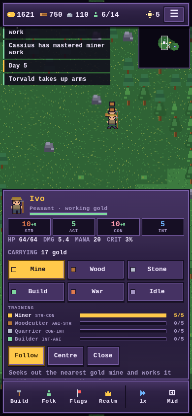

# Realm of Majesty

A 16-bit kingdom sim, written as a single dependency-free web page and built to be
played with a thumb on a phone.

**The premise:** you are a small god with a valley full of peasants. You do not
micromanage them. You tell each one **what they are for**, and they go and find the
work themselves.



## Playing

- **One finger drags** the map, **two fingers pinch** to zoom, **tap** to select.
- **Zoom** steps through Close / Mid / Far / Wide. Tap the corner map to open the whole
  realm, then tap anywhere on it to jump there.
- Select any unit and hit **Follow** to lock the camera onto it; drag the map to let go.
- **Tap your City Centre** → *Hire Peasant*.
- **Tap a peasant** and pick a calling: **Mine**, **Wood**, **Stone**, **Build** or **Idle**.
- Or open the **Folk** tab to move the workforce around in bulk, or pick one villager
  by name and give them a calling of their own.
- **Build** a Barracks, train warriors, then raise a **Flag** to tempt them somewhere.

Keyboard, if you are at a desk: `B` peasants, `K` realm, `P` select peasants,
`M` full map, `C` follow the selected unit, `space` pause, arrows pan, `+`/`-` zoom,
shift-drag to box-select.

## Callings

A calling is permanent until you change it, and it is a *standing instruction*, not a
destination. A Miner walks to the nearest gold seam, works it until it is empty, and
then walks to the next nearest one without being asked. When there is genuinely nothing
left they say so by name and wait near home rather than milling about pretending.

| Calling | What they do |
|---|---|
| **Miner** | Finds the nearest gold mine and works it out, then the next. |
| **Woodcutter** | Fells the nearest woodland tree by tree; felled trees disappear. |
| **Quarrier** | Cuts stone at the nearest quarry and moves on when it is spent. |
| **Builder** | Runs to whatever is half-built or damaged. |
| **Idle** | Loiters near home and lends a hand with construction. |

You can still override a calling by tapping a **specific** mine, quarry or tree — that
sets the matching calling *and* starts them on the seam you picked. The **Peasants** tab
also lists every peasant by name, so you can single one out and give them a calling of
their own.

## Attributes

Every unit has four attributes. They read in steps of five, and five is the baseline —
a unit with straight fives behaves exactly as its raw definition says.

| Attribute | Effect |
|---|---|
| **Strength** | +8% melee damage per 5 points |
| **Agility** | +6% attack speed per 5 points |
| **Constitution** | +6 health per point |
| **Intelligence** | +4 mana per point, and +3% critical chance per 5 points |

Peasants start at 5 across the board; hero classes start lopsided (a warrior is strong
and tough and never crits, a wizard is frail and crits often) which is the seed of the
class system.

**Work is what changes them.** Each calling trains two attributes, up to five points
each, and progress only accrues while a peasant is *actually doing the job* — walking
to the seam and hauling the load home teach nothing.

| Calling | Trains |
|---|---|
| Miner | STR + CON |
| Woodcutter | AGI + STR |
| Quarrier | CON + INT |
| Builder | INT + AGI |

Points earned are permanent and stack across callings, so a peasant who has mastered
mining and then woodcutting ends up at STR 15. Veterans are worth keeping.

Tap any peasant and their sheet shows all four tracks at once — mastered, part-done,
and never started — so you can see exactly what a given villager has become.

**Warriors grow by rank instead.** They cap at **level 5**, and every level grants
**+3 to every attribute** — the only thing levels do, so a hero's numbers come from one
place. A fresh warrior beats a skeleton and loses to an ogre; a level-5 one kills the
ogre with a third of its health left.

Every load walks back to the City Centre, so **distance is the whole economy**. Where
the seams fell on your map decides how rich you are.

## Warriors and flags

Build a **Barracks** and you can arm Warriors — but a warrior is not conjured out of
gold. One of your **villagers** puts down the pick and takes up a sword, so every
soldier costs you a worker as well as coin. Set a villager's calling to **War**, or use
the Barracks' own button and it calls up whoever is idle.

Everything the work taught them comes along: a villager who mastered mining becomes a
STR 18 / CON 17 warrior with 202 health, where one straight off the farm starts at
13 / 12 and 172. Veterans make better soldiers.

Unlike peasants, warriors then take no orders at all — they patrol, explore the dark,
and pick their own fights. The only way to steer them is to put money on the map:

- **Attack** — paid when the area is cleared of monsters and lairs.
- **Explore** — paid on arrival; the fog lifts around it.
- **Defend** — pays out gradually while a warrior holds the ground.
- **Fear** — free, and makes them avoid a place entirely.

Gold on a flag sits in escrow (shown in brackets beside your treasury) and is refunded
in full if you withdraw it.

Peasants are not completely helpless. They will run from a monster they merely see, but
something already biting them gets hit back — and they break off and flee once badly
hurt. A lone peasant can see off a rat; anything larger needs a warrior.

## Current scope

Still deliberately small while the core is built out: City Centre, Barracks, peasants,
warriors and flags. The shops, towers, huts and the other three hero classes are
defined but switched off behind `BUILD_ORDER_FULL` in `src/data.js`.

Raids are on. After a few days of peace, lairs close enough to your buildings send
parties at the town — so expanding toward a nest is what makes it hostile. Build a
Barracks and warriors will meet them in the field; build nothing and your peasants get
picked off around day 17 and the City Centre erodes from there.

## Running it locally

No build step, no dependencies. Any static server will do:

```bash
python3 -m http.server 8000
# then open http://localhost:8000
```

Add `?seed=12345` to the URL to replay a specific realm.

## Deployment

Pushing to the default branch runs `.github/workflows/deploy.yml`, which publishes
the repository root to GitHub Pages. It needs **Settings → Pages → Source: GitHub Actions**
enabled once on the repository.

## Layout

```
index.html          shell, HUD markup
styles.css          16-bit UI skin, mobile-first
src/
  main.js           boot, frame loop, onboarding
  game.js           simulation core: economy, flags, spawning, victory
  brains.js         peasant callings, plus the dormant hero / guard / monster AI
  entities.js       units, buildings, lairs, projectiles
  world.js          map generation, fog of war, A*
  render.js         camera, depth-sorted drawing, pixel font, minimap
  ui.js             DOM panels and all pointer input
  art.js            every sprite, generated at runtime from code
  audio.js          WebAudio chiptune SFX and music
  data.js           missions, balance numbers, and what is switched on
  fx.js             particles and floating text
  util.js           RNG, math, binary heap
```

There are no image or audio assets: sprites are drawn from character grids and
procedural shapes at load time, and the sound is synthesised square waves.
